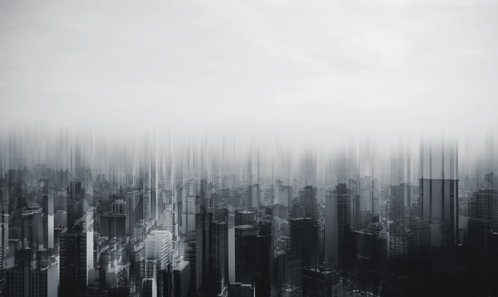
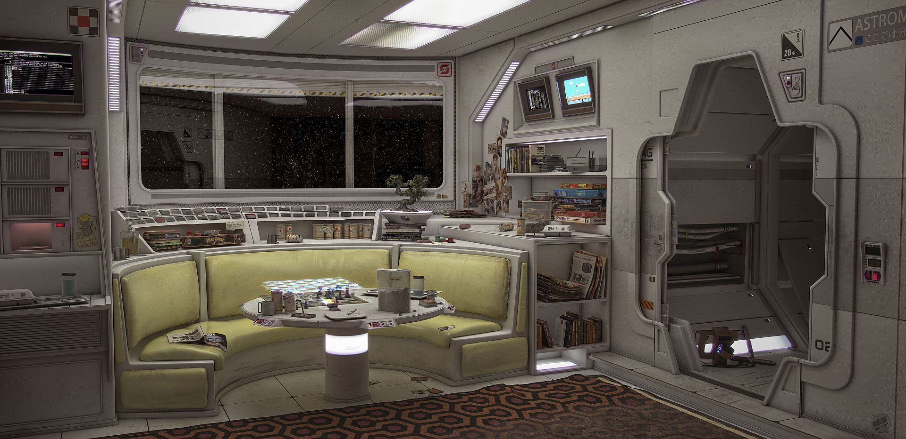
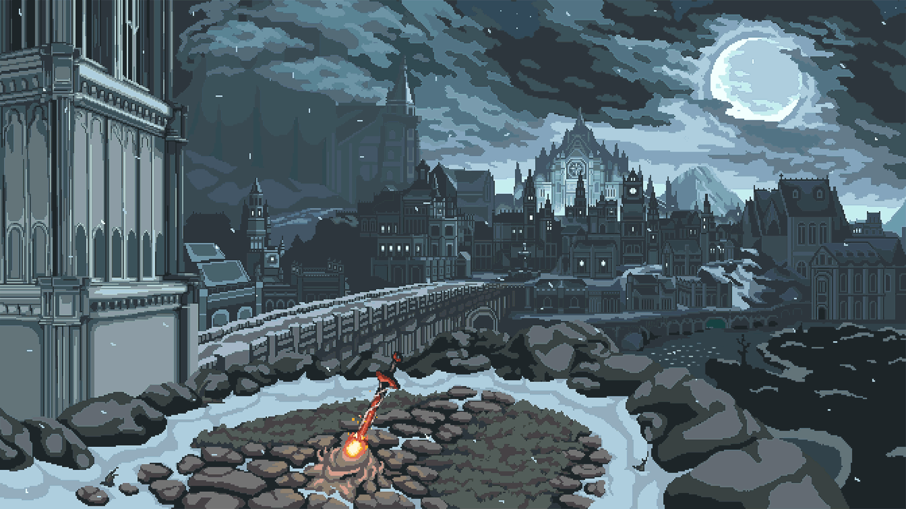
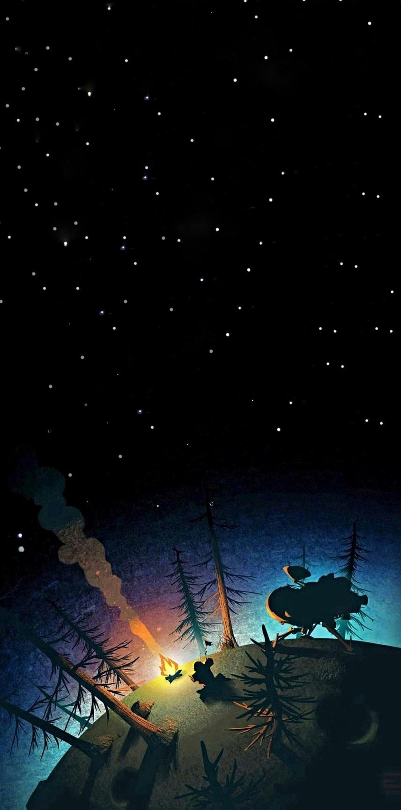
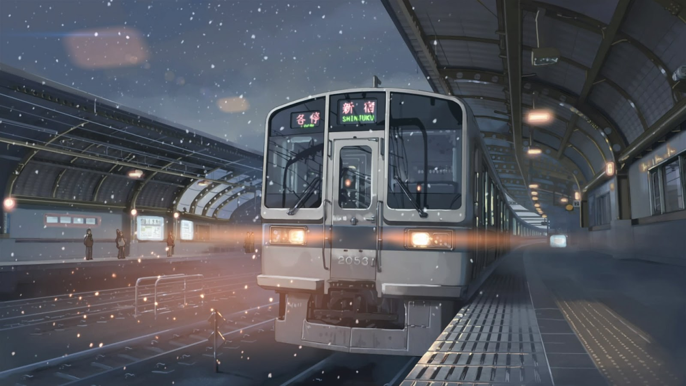

# Wallpapers

My wallpaper collection! I use [`nitrogen`](https://wiki.archlinux.org/index.php/Nitrogen) as my wallpaper setter.

## Directories
| Name | Example |
| --- | --- |
| 3d           | 
| building     | 
| city         | 
| cozy         | 
| edits        | 
| flower       | 
| geometric    | 
| gif          | 
| gradient     | 
| illustration | 
| landscape    | 
| phone        | 
| sky          | 
| tile         | 
| trains       | 
